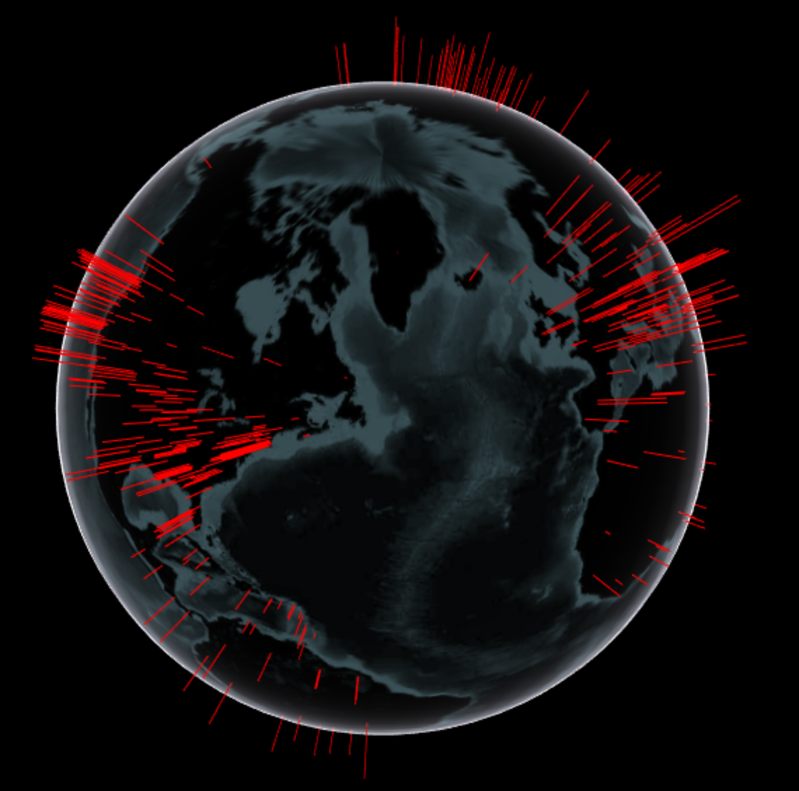

# tidycseeCOVID19

<!-- badges: start -->
<!-- badges: end -->

tidycseeCOVID19 is a data package that aims to provide a curated, [tidy](https://cran.r-project.org/web/packages/tidyr/vignettes/tidy-data.html)
version of the [JHU CSEE COVID19](https://github.com/CSSEGISandData/COVID-19) [daily report](https://github.com/CSSEGISandData/COVID-19/tree/master/csse_covid_19_data/csse_covid_19_daily_reports) data.

## Installation

You can install the latest version of the data package from github:

``` r
remotes::install_github("klucar/tidycseeCOVID19")
```

## Example

Example of how to load data and create a globe-histogram:



``` r
library(tidycseeCOVID19)
data("covid19_daily")
covid19 <- tibble::as_tibble(covid19_daily)

library(ggmap)
library(threejs)
library(tidyverse)
library(tidycseeCOVID19)

data("covid19_daily")
covid19 <- tibble::as_tibble(covid19_daily)

# This probaby isn't the right way, but just get a plot
# out for now.
plot_data <- covid19 %>%
  group_by(Latitude, Longitude) %>%
  summarise(Confirmed_sum = sum(Confirmed))

# Plot the data on the globe
globe <- globejs(lat = plot_data$Latitude,
                 long = plot_data$Longitude,
                 val = 20* log10(plot_data$Confirmed_sum),
                 color = 'red',
                 pointsize = 0.5,
                 atmosphere = TRUE)

globe
```

## Data Transforms

The raw data files have become more consistent recently, but the early data
files had many different formats. This dataset has done the following to the data:

  * Removed Ship information into separate column, keeping Country where available.
  * Converted Update date/time strings into R dttm format.
  * Normalized / Standardized Country names.
  * Separated City, State entries into separate columns
  * Backfilled Lat/Long data into early entries
  * Expanded US State abbreviations and other abbreviations.
  
## HELP!

I made my best guess as to what was the right thing to do when normalizing everything.
I'm not a world geography expert so if you find errors, please let me know. Here's some
things I'm not sure of:

  * China Mainland Provinces: Some are really close in spelling, not sure if these are separate
  provinces or typos.
  * Not sure if Guinea and Ecuatorial Guinea are the same country.
  * There's a lot of hand-jamming some values, let me know of any inconsistencies you find.

